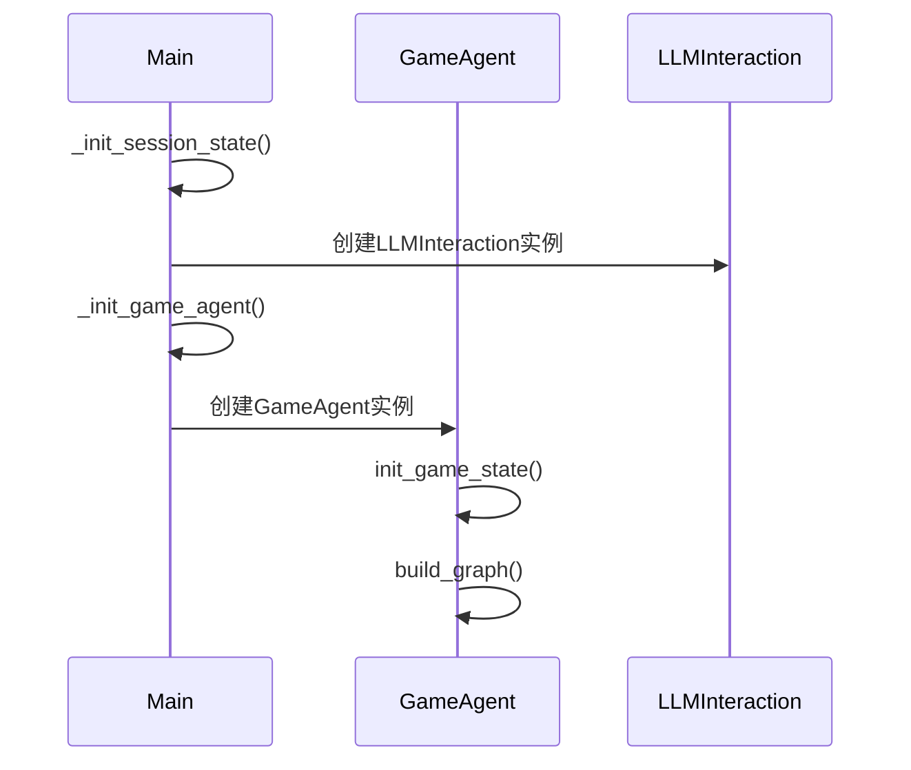
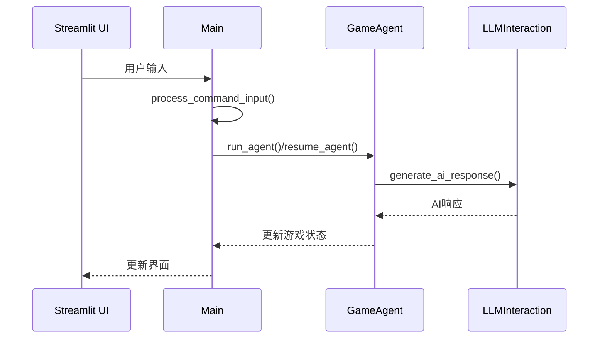
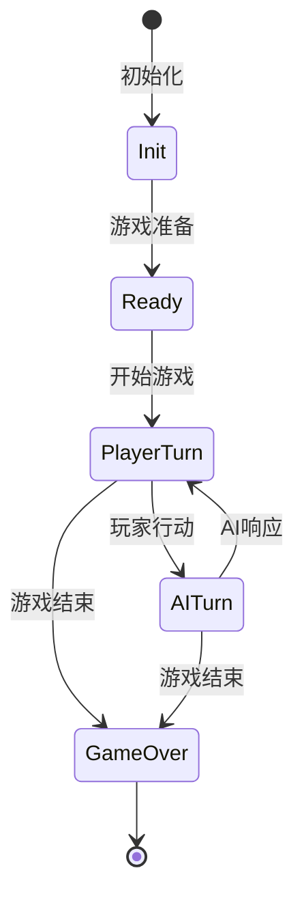
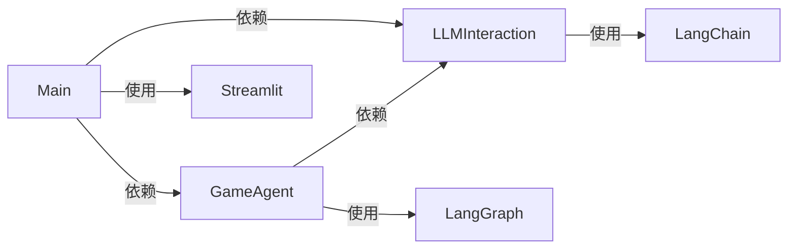

# LLM游戏框架分析报告

## 1. 代码结构分析

### 1.1 核心组件

1. **主程序 (main.py)**
   - 负责GUI界面渲染和交互逻辑
   - 使用Streamlit构建用户界面
   - 管理会话状态和游戏循环
   - 处理用户输入和界面更新

2. **游戏代理 (game_agent.py)**
   - 基于LangGraph构建的游戏工作流管理器
   - 维护游戏状态和状态转换
   - 处理游戏逻辑和规则验证
   - 管理游戏进程

3. **LLM交互 (llm_interaction.py)**
   - 管理与大语言模型的交互
   - 支持多种LLM模型(Google/OpenAI/DeepSeek)
   - 处理对话历史和上下文管理
   - 生成AI响应

### 1.2 技术栈

- **前端**: Streamlit
- **AI框架**: LangChain, LangGraph
- **LLM模型**: 支持Gemini/GPT/DeepSeek
- **状态管理**: Streamlit Session State
- **异步处理**: Python asyncio

## 2. 模块交互分析

### 2.1 初始化流程



初始化流程说明:
1. `main.py`首先初始化会话状态
2. 创建`LLMInteraction`实例用于管理AI对话
3. 创建`GameAgent`实例并初始化游戏状态
4. 构建LangGraph工作流图

### 2.2 游戏循环流程



游戏循环说明:
1. 用户通过Streamlit界面输入指令
2. `main.py`处理输入并传递给`GameAgent`
3. `GameAgent`根据状态调用`LLMInteraction`生成响应
4. 状态更新后反馈到界面

## 3. 关键交互接口

### 3.1 GameAgent与LLMInteraction

```python
# GameAgent调用LLMInteraction的示例
async def process_user_input(self, state: GameState) -> GameState:
    # 1. 准备上下文
    game_context = self._prepare_game_context(state)
    
    # 2. 调用LLM生成响应
    ai_response = await self.llm_interaction.generate_ai_response(
        user_input=state["last_action"],
        game_state=game_context
    )
    
    # 3. 解析响应并更新状态
    new_state = self._update_game_state(state, ai_response)
    return new_state
```

### 3.2 Main与GameAgent

```python
# Main模块与GameAgent交互示例
async def _process_game_loop():
    if not st.session_state.game_started:
        # 1. 启动游戏
        game_state = await st.session_state.game_agent.run_agent(
            config=st.session_state.config
        )
    else:
        # 2. 处理用户输入
        user_input = st.session_state._user_chat_input
        if user_input:
            # 3. 恢复游戏状态
            game_state = await st.session_state.game_agent.resume_agent(
                thread_id=st.session_state.thread_id,
                config=st.session_state.config
            )
```

## 4. 状态管理

### 4.1 GameState状态定义

```python
class GameState(TypedDict):
    game_started: bool          # 游戏是否开始
    messages: List             # 对话历史记录
    current_turn: str          # 当前回合玩家
    game_over: bool           # 游戏是否结束 
    game_data: dict           # 游戏数据
    last_action: str          # 最后执行的动作
    phase: str                # 游戏阶段
    valid_actions: List[str]  # 当前可用动作
    thread_id: str            # 会话ID
    error: Optional[str]      # 错误信息
    info: Optional[str]       # 消息提示
```

### 4.2 状态转换流程



## 5. 异步处理机制

```python
# 异步处理示例
async def _process_streaming_agent():
    try:
        # 1. 异步获取游戏状态
        game_state = st.session_state.game_agent.get_game_state()
        
        # 2. 异步处理用户输入
        if st.session_state._user_chat_input:
            user_input = st.session_state._user_chat_input
            st.session_state._user_chat_input = None
            
            # 3. 异步生成响应
            async for chunk in st.session_state.game_agent.stream_run(
                user_input, game_state
            ):
                # 4. 处理流式响应
                process_stream_chunk(chunk)
                
    except Exception as e:
        handle_error(e)
```

## 6. 模块依赖分析



## 7. 改进建议

### 7.1 架构层面

1. **错误处理增强**
```python
class GameError(Exception):
    def __init__(self, error_type: str, message: str):
        self.error_type = error_type
        self.message = message
        super().__init__(message)

# 使用示例
try:
    await game_agent.process_action(action)
except GameError as e:
    handle_game_error(e)
```

2. **状态观察者模式**
```python
class GameStateObserver:
    def on_state_change(self, old_state: GameState, new_state: GameState):
        pass

class GameAgent:
    def __init__(self):
        self.observers: List[GameStateObserver] = []
        
    def add_observer(self, observer: GameStateObserver):
        self.observers.append(observer)
        
    def _notify_state_change(self, old_state: GameState, new_state: GameState):
        for observer in self.observers:
            observer.on_state_change(old_state, new_state)
```

### 7.2 功能层面

1. **LLM响应缓存**
```python
class CachedLLMInteraction(LLMInteraction):
    def __init__(self):
        super().__init__()
        self.cache = {}
        
    async def generate_ai_response(self, user_input: str, game_state: dict) -> str:
        cache_key = self._generate_cache_key(user_input, game_state)
        if cache_key in self.cache:
            return self.cache[cache_key]
            
        response = await super().generate_ai_response(user_input, game_state)
        self.cache[cache_key] = response
        return response
```

2. **状态差异更新**
```python
def update_game_view(old_state: GameState, new_state: GameState):
    # 只更新发生变化的部分
    changes = get_state_changes(old_state, new_state)
    for key, value in changes.items():
        update_ui_component(key, value)
```

### 7.3 性能优化

1. **配置管理优化**
   - 将配置项集中管理
   - 实现配置热重载
   - 添加配置验证机制

2. **监控与日志**
   - 增加性能监控
   - 完善日志记录
   - 添加用户行为分析

## 8. 设计建议

1. **组件设计**
   - 保持Streamlit组件的标准化使用
   - 避免过度定制化UI
   - 注重组件的可重用性

2. **状态管理**
   - 充分利用LangGraph的状态管理能力
   - 设计清晰的状态转换流程
   - 注重状态一致性维护

3. **LLM集成**
   - 统一LLM接口设计
   - 实现模型无关的抽象层
   - 注重提示工程的规范化

4. **可扩展性**
   - 预留功能扩展接口
   - 设计插件化架构
   - 支持自定义游戏逻辑

## 9. 总结

该框架展现了一个设计良好的LLM游戏架构:

1. **模块化设计**
   - 清晰的职责分离
   - 良好的接口封装
   - 易于维护和扩展

2. **交互流程**
   - 状态流转逻辑清晰
   - 异步处理机制完善
   - 数据流向明确可控

3. **优化方向**
   - 引入更多设计模式
   - 增强错误处理机制
   - 优化性能和缓存

建议在后续开发中重点关注:
1. 接口标准化
2. 状态管理优化
3. 性能提升
4. 错误处理完善
